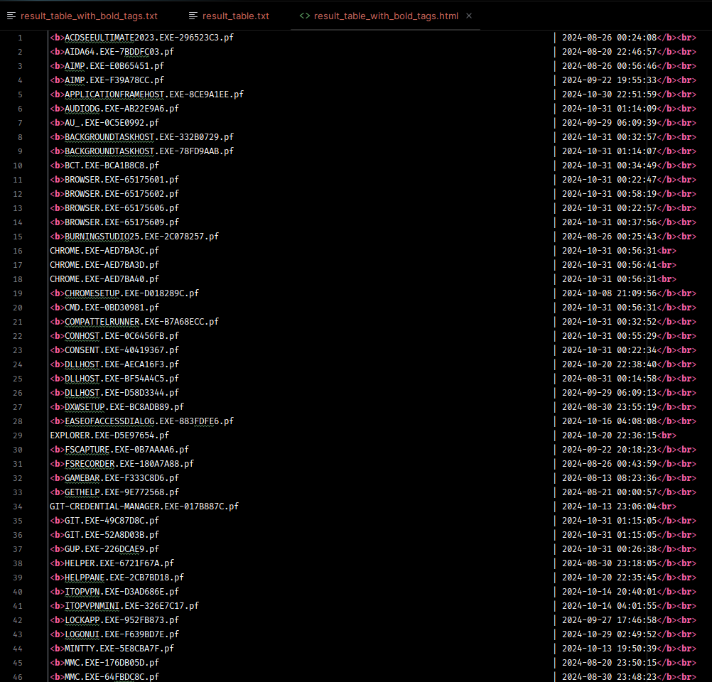

# Black & White lists

Данная программа проверяет запущенное ПО в операционной системе Windows на соответствие Чёрному или белому листу 

# Запуск
- Склонировать репозиторий
- Запустить main.py от имени администратора (так как директория %WinDir%\Prefetch требует права администратора)

# ТЗ

Проверяется запускаемое ПО с помощью черного или белого списка разрешений. 

## Ограничения: 
Python 3.6\
Код оформлен по PEP8

## Описание:
Обнаружение и проверка запускаемого ПО с отображением даты запуска. 
Запускаемое ПО не имеющее отношения к работе вашей организации может нести в себе угрозу безопасности данным, повышает вероятность заражения ПК и компьютерных сетей. Для обеспечения безопасности требуется контроль за ПО запускаемом на ПК.

Информация берется из %WinDir%\Prefetch.
Контроль требует прав доступа к директории и файлам %WinDir%\Prefetch

В папке, интересующие файлы имеют вид: CHXSMARTSCREEN.EXE-061DFBA0.pf

В программе можно задавать список файлов в виде текстового файла "имя_файла.exe", (другие расширения не учитывать) для контролирования запуска ПО по белому или черному списку. 
Список задается в переменной "Список ПО".
Каждый софт отделен друг от друга новой строкой.

Пример: 
CHXSMARTSCREEN.EXE
имя_файла1.exe
имя_файла2.exe

## Входные данные: 
1) Переменная "Тип проверки" - выбирается тип сравнения списка. Белый список или Черный список. (одновременно не используются)
   - Белый список - только разрешенные программы
   - Черный список - проверяется на отсутствие запрещенных программ 

2) Список файлов с папки %WinDir%\Prefetch

## Выходные данные: 
1) Программа выводит список ПО с датами запуска в формате:
Наименование запускаемого файла | дата запуска 
выделяя жирным шрифтом (обрамляемся тегами текст <b> <\b>) ПО несоответствующее условиям контроля.

2) Статус сравнения
В случае отсутствия прав на получение информации от файлов программа выдает конечный вердикт (статус) о безопасности.\
Возможные статусы: соответствует/не соответствует

## Статус соответстия достигается:
- когда в требуемой папке находятся программы только из "белого списка"
- когда в требуемой папке отсутствуют программы из "черного списка"

Остальные случаи не относятся к соответствию требованиям. 

Результирующую таблицу выводить в отдельный файл расширения txt\
Список отсортировать по алфавиту

Сделать интерфейс для вывода результата

# Реализация

## Стэк
Python 3.6\
Tkintr - UI interface

## UI Описание

Главное окно с выбором файлв и опции сканирования\

Вывод окна с ошибкой при отправке неполной формы\

Запуск программы в одном и другом режиме\
- Запуск с чёрным листом\

- Запуск с белым листом\

Пример белого и чёрного листа\

Результаты сканирования при соответствующим и несоответствующим ПО\
- соответствует\

- несоответствует\

После проведения сканирования и перед выводом результата создаётся директория /data на одном уровне с `/src`\

В этой директории сохраняются отчёты по сканированию в разных форматах:\
- `result_table.txt` - Результирующая таблица с форматированием, но без выделения\

- result_table_with_bold_tags.txt - Результирующая таблица с выделением в формате TXT\

- result_table_with_bold_tags.html - Результирующая таблица с выделением в формате HTML\
\
В браузере она выглядит так\
\
Есть выделенные строки с несоответствующим ПО
